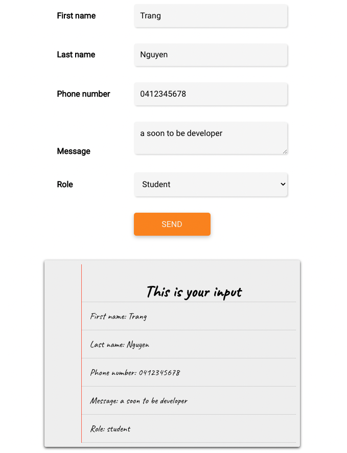
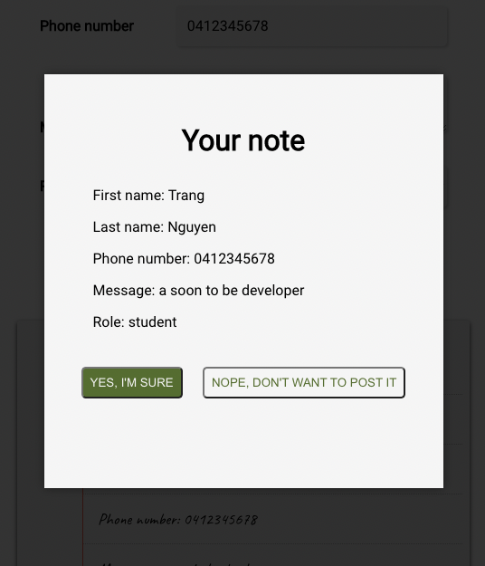

# Class-room practice

REACT project to learn condition rendering, props, state, add handler to event.

## Description

- The filled data will be display instantly in the field below it(which looks like a notebook) using onChange.
- After "send button" is clicked, a popup field will be appeared which store all filled data.

### Screenshot

